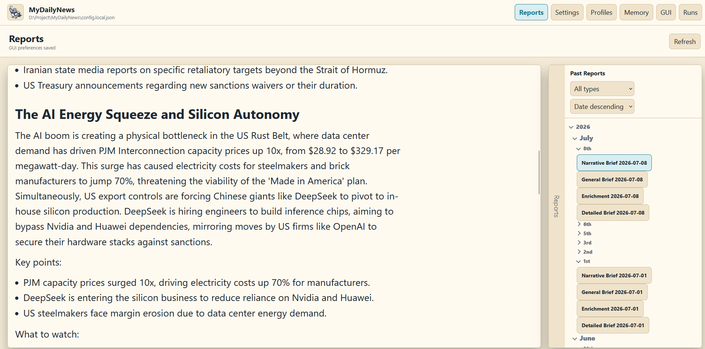
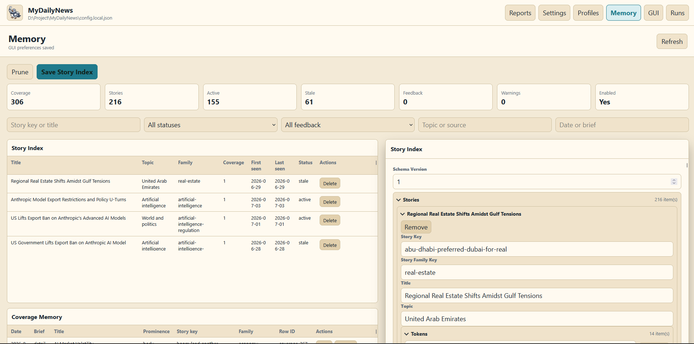
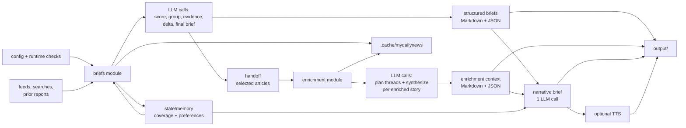

<p align="center">
  
</p>

# MyDailyNews

MyDailyNews is an LLM driven personal news brief generator. It fetches current headlines according to your editable profile then scores, reorders, and aggregates them to give you both the world macro news and focused topics news. With the optional modules enabled, it further examines notable topics, researches it through keyword searches, and gives you an enhanced report that narratively clusters the stories around the most interesting topics of the day. All of this is driven by local LLM, with editable user profiles and memory also being entirely local.

To get started, see [docs/setup.md](docs/setup.md).

## Screenshots





## Try The Demo GUI

Explore the GUI with bundled reports, audio, and memory fixtures:

```bash
python gui.py --config fixtures/gui_demo/config.demo.json --port 8766
```

Then open `http://127.0.0.1:8766`.


## To DO
- Improve Perspectives Module
- Improve global news coverage
- Improve memory editing
- Better AI endpoints support
- New Map feature

## What It Does

- Builds general and topic-focused news briefs from RSS, Google News, and configured topic searches.
- Uses a local `/v1/chat/completions` endpoint; the default is LM Studio at `http://127.0.0.1:1234/v1`.
- Writes inspectable local artifacts under `output/`, `state/memory/`, and `.cache/mydailynews/`.
- Can run from the CLI, Docker, or the local GUI.
- Keeps optional local memory for coverage, story repetition, feedback, and learned preferences.
- Can turn saved Markdown briefs into WAV audio with Kokoro TTS.

## Architecture Flow



## Start Here

Use [setup](docs/setup.md) for install, config, first run, GUI, Docker, TTS, and test commands. The default path uses LM Studio or another already-running OpenAI-compatible local server.

## Docs

- [Setup](docs/setup.md): environment, config, first run, GUI, Docker, TTS, and tests.
- [CLI](docs/cli.md): normal runs, standalone module runs, and common flags.
- [Configuration](docs/configuration.md): config sections and runtime rules.
- [Architecture](docs/architecture.md): runtime model and module flow.
- [Evaluation](docs/evaluation.md): offline multi-day corpus, metrics, adapters, and quality gates.
- [Story quality](docs/story-quality.md): current findings, next experiment, and deferred work.
- [Docker](docs/docker.md): container usage.
- [Hardware profiles](docs/hardware_profiles.md): model and context sizing.
- [TTS audio](docs/tts.md): Kokoro setup and audio output.
- [Managed llama-server mode](docs/llama_cpp_setup.md): advanced alternative to LM Studio/external server mode.
- [Troubleshooting](docs/troubleshooting.md): common startup and output issues.

## Outputs

Normal runs write briefs and diagnostics under `output/`. Durable memory lives under `state/memory/`. Caches live under `.cache/mydailynews/`.

## License

MIT. See [LICENSE](LICENSE).
