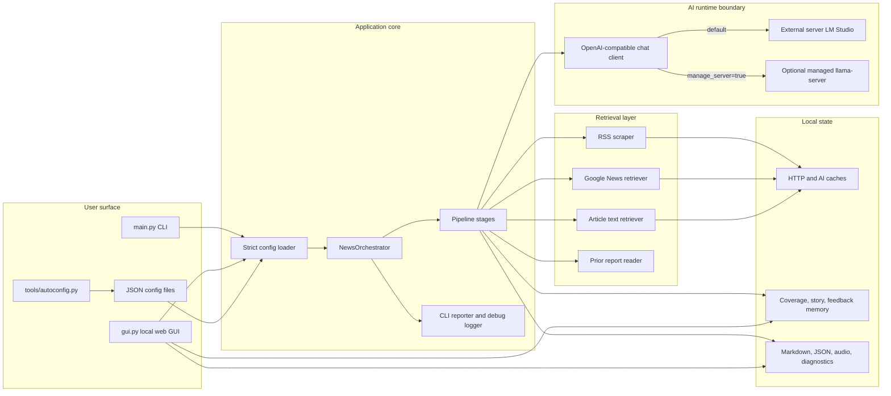
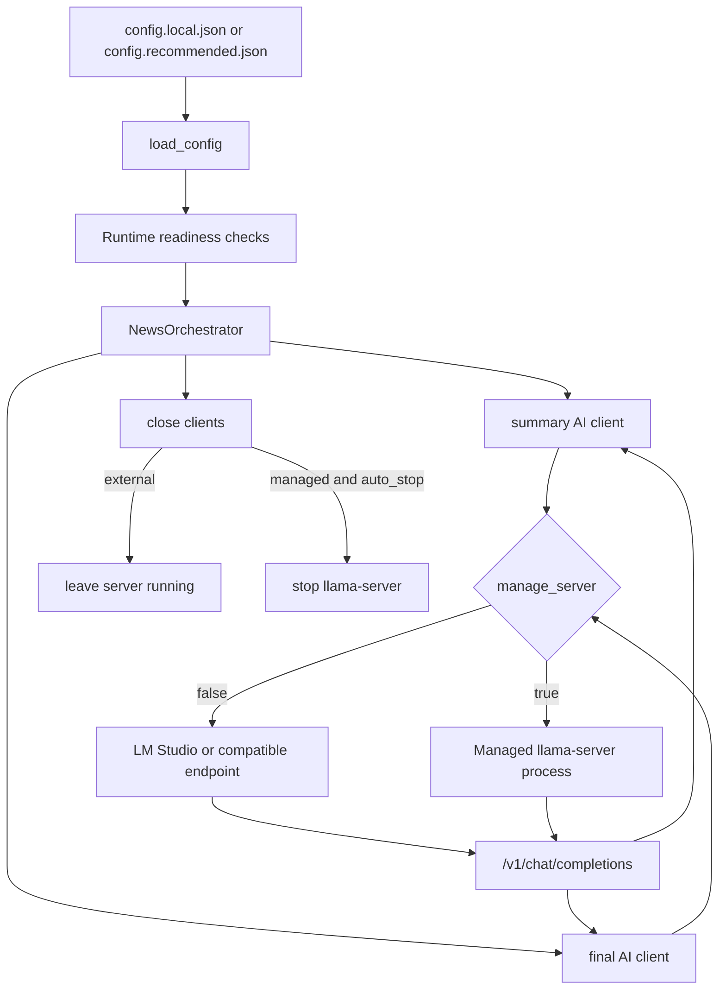
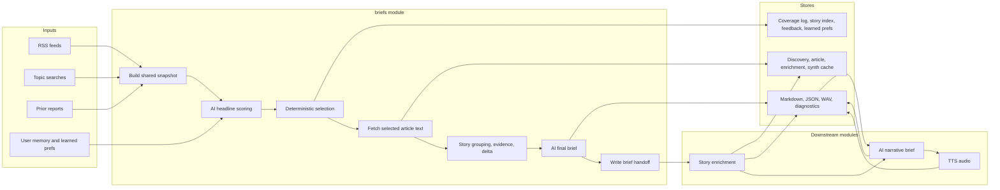

# MyDailyNews Architecture

MyDailyNews is a local-first news briefing pipeline. It fetches news inputs, scores and summarizes them through an OpenAI-compatible chat endpoint, writes Markdown/JSON outputs, and optionally adds enrichment, narrative briefing, memory, feedback, GUI control, and TTS audio.

## Runtime Model

By default, MyDailyNews expects an already-running OpenAI-compatible local server, usually LM Studio at `http://127.0.0.1:1234/v1`.

It does not start LM Studio itself. LM Studio owns model loading, GPU offload, context size, and serving. MyDailyNews connects to that endpoint and sends `/chat/completions` requests.

The older managed local server path still exists for `llama-server`. If a config sets `manage_server=true` and provides `server_executable`, `server_model_path`, and `server_arguments`, MyDailyNews can start `llama-server`, wait for readiness, reuse it during the run, and stop it when `server_auto_stop=true`.



## Top-Level Run Flow



## Default Series Pipeline

The default module series is:

```text
briefs -> enrichment -> narrative_brief
```

TTS is available but disabled by default. Add `tts` after `narrative_brief` when audio should be part of normal runs.



## Data Movement

```mermaid
flowchart TD
    subgraph Output_Dir["output/"]
        BRIEF_MD[general and detailed Markdown]
        BRIEF_JSON[general and detailed JSON]
        HANDOFF_JSON[handoff JSON]
        ENRICH_JSON[enrichment JSON and Markdown]
        NARR_JSON[narrative JSON and Markdown]
        AUDIO[WAV and audio JSON]
        DIAG[diagnostics and stage artifacts]
    end

    subgraph Memory_Dir["state/memory/"]
        COVERAGE[coverage_log.jsonl]
        STORIES[story_index.json]
        FEEDBACK[feedback_events.jsonl]
        LEARNED[learned_preferences.json]
        RECALL[recall_packets]
        BACKUPS[backups]
    end

    subgraph Cache_Dir[".cache/mydailynews/"]
        DISCOVERY[discovery responses]
        ARTICLE_CACHE[article text and aliases]
        ENRICH_CACHE[enrichment retrieval]
        SYNTH_CACHE[AI synth cache]
    end

    PIPELINE[Pipeline stages] --> BRIEF_MD
    PIPELINE --> BRIEF_JSON
    PIPELINE --> HANDOFF_JSON
    PIPELINE --> ENRICH_JSON
    PIPELINE --> NARR_JSON
    PIPELINE --> AUDIO
    PIPELINE --> DIAG
    PIPELINE --> COVERAGE
    PIPELINE --> STORIES
    PIPELINE --> RECALL
    PIPELINE --> DISCOVERY
    PIPELINE --> ARTICLE_CACHE
    PIPELINE --> ENRICH_CACHE
    PIPELINE --> SYNTH_CACHE
    GUI[GUI memory and feedback tools] --> FEEDBACK
    GUI --> LEARNED
    GUI --> BACKUPS
    LEARNED --> PIPELINE
    COVERAGE --> PIPELINE
    STORIES --> PIPELINE
```



## Main Files

- `main.py`: CLI entrypoint.
- `tools/autoconfig.py`: hardware detection, endpoint probing, and recommended config writer.
- `mydailynews/app/config.py`: strict JSON config loader.
- `mydailynews/ai/llama_cpp_server_client.py`: OpenAI-compatible chat client.
- `mydailynews/ai/managed_llama_server.py`: optional managed `llama-server` lifecycle.
- `mydailynews/pipeline/orchestrator.py`: top-level module orchestration.
- `mydailynews/pipeline/stages.py`: module and stage names.
- `mydailynews/gui/server.py`: local GUI HTTP server.
- `mydailynews/gui/data.py`: GUI data, feedback, memory, and run management surface.

## Outputs And State

```text
output/
  YYYY-MM-DD_general_brief.md
  YYYY-MM-DD_general_brief.json
  YYYY-MM-DD_detailed_brief.md
  YYYY-MM-DD_detailed_brief.json
  YYYY-MM-DD_enrichment.md
  YYYY-MM-DD_enrichment.json
  YYYY-MM-DD_narrative_brief.md
  YYYY-MM-DD_narrative_brief.json
  *.wav
  *_audio.json
  diagnostics/

state/memory/
  coverage_log.jsonl
  story_index.json
  feedback_events.jsonl
  learned_preferences.json
  recall_packets/
  backups/

.cache/mydailynews/
  discovery/
  enrichment/
  article_text/
  article_aliases/
  synth/
```
