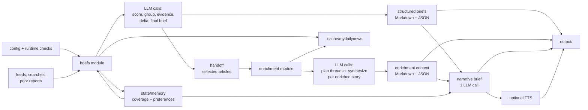
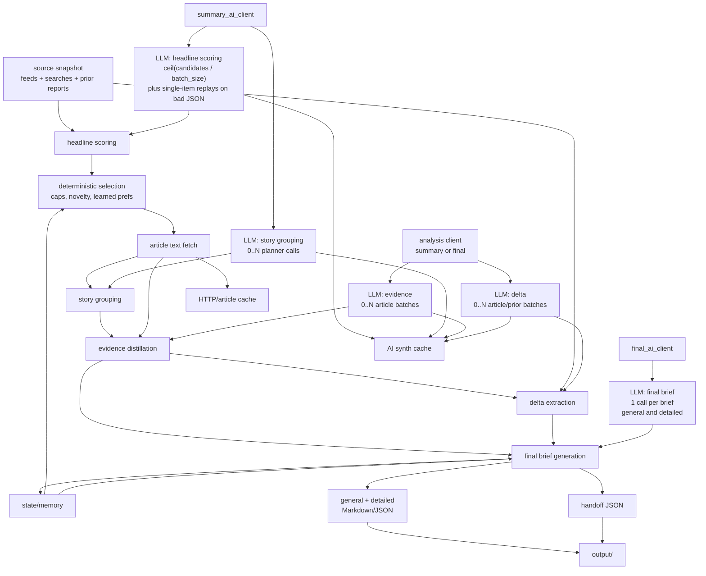
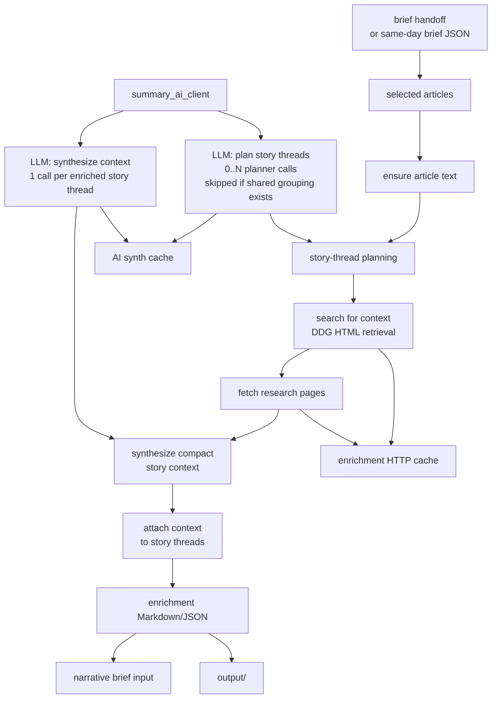

# MyDailyNews Architecture

MyDailyNews is a local-first pipeline around an OpenAI-compatible chat endpoint. The app owns fetching, ranking, prompting, local state, and output files. The model server owns model loading, GPU offload, context size, and serving.

## Runtime Model

Default runtime:

```text
CLI or GUI -> config loader -> runtime checks -> NewsOrchestrator
    -> retrieval, ranking, analysis, AI calls
    -> output/, state/memory/, .cache/mydailynews/
```

By default, MyDailyNews expects an already-running local server such as LM Studio at `http://127.0.0.1:1234/v1`. It sends `/chat/completions` requests and leaves the server running.

The managed `llama-server` path is still available for advanced users. Set `manage_server=true` with `server_executable`, `server_model_path`, and `server_arguments` to let MyDailyNews start and stop `llama-server`. See [managed llama-server mode](llama_cpp_setup.md).

## Overall Flow



## Briefs Module



## Enrichment Module



LLM call groups: headline scoring is batched, story grouping and enrichment planning can split into multiple planner calls, evidence and delta are optional batched analysis calls, final brief is normally one call per structured brief, narrative brief is normally one call, and enrichment synthesis is one call per enriched story thread. Cache hits skip eligible calls; JSON/transport retries can add attempts.

AI roles: `summary_ai_client` scores and plans; the configurable analysis client runs evidence/delta; `final_ai_client` writes final and narrative briefs.

Storage roles: `.cache/mydailynews/` stores network/article/enrichment fetches, `.cache/mydailynews/synth` stores reusable AI responses, `state/memory/` stores durable coverage/preferences, and `output/` stores reports, handoffs, diagnostics, and stage artifacts.

## Module Flow

The default module series is:

```text
briefs -> enrichment -> narrative_brief
```

`tts` is available but disabled by default. Add it after `narrative_brief` when audio should be part of normal runs.

Modules:

- `briefs`: fetches candidates, scores headlines, selects articles, fetches article text, runs analysis, writes general and detailed briefs.
- `enrichment`: groups selected articles into story threads, retrieves related context, and writes enrichment artifacts.
- `narrative_brief`: turns structured brief and enrichment JSON into a narrative Markdown brief.
- `tts`: turns a saved Markdown brief into WAV audio and audio metadata.

## State Boundaries

- `output/`: generated Markdown, JSON, WAV, diagnostics, and stage artifacts.
- `state/memory/`: durable coverage, story, feedback, learned-preference, recall, and backup files.
- `.cache/mydailynews/`: discovery, article text, enrichment retrieval, and AI synthesis caches.

Deleting `output/` removes generated reports. Deleting `state/memory/` resets local memory. Deleting `.cache/mydailynews/` only forces refetching or regeneration.

## Stable Entrypoints

- `main.py`: CLI.
- `gui.py`: local web GUI launcher.
- `tools/autoconfig.py`: hardware detection and recommended config writer.
- `mydailynews/app/config.py`: strict config loading.
- `mydailynews/app/runtime_config.py`: runtime readiness checks.
- `mydailynews/pipeline/orchestrator.py`: module orchestration.
